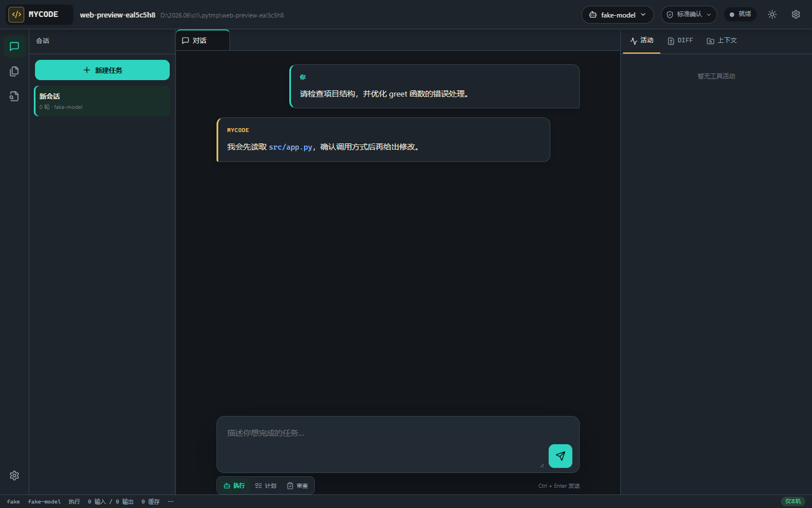

# MyCode

MyCode 是一个本地优先的 AI 编程 Agent。它可以理解项目、检索代码、修改文件、执行测试，
并通过 CLI、本地 Web 工作台、TUI 和 VS Code 扩展完成整个开发流程。

> 当前版本为 Alpha。请先在受信任的项目和可回滚的 Git 工作区中使用。



## 核心能力

- **多模型配置**：支持 OpenAI、DeepSeek、Claude、Gemini、Kimi、千问、GLM、MiniMax
  以及自定义 OpenAI 兼容端点。
- **本地凭据管理**：API Key 默认保存到 Windows Credential Manager、macOS Keychain 或
  Linux Secret Service，不写入项目配置文件。
- **完整 Agent Loop**：读取、搜索、编辑、Patch、Shell、Git、Diff 审批、取消和失败恢复。
- **三种工作模式**：执行、只生成计划、只读代码审查。
- **代码智能**：本地 SQLite 符号索引、Python AST、可选 LSP、定义/引用/诊断和精准上下文。
- **可观察与可回归**：结构化事件、JSONL Trace、离线 Eval 和可选真实模型 Eval。
- **可扩展**：MCP Client、Skill 和 Python 插件系统。
- **本地多界面**：CLI、React Web 工作台、Textual TUI 和 VS Code 扩展共用同一运行内核。

## 环境要求

- Python 3.11-3.14
- Git（推荐，用于 Diff、撤销和提交）
- Node.js 22（仅开发 Web/VS Code 前端时需要）

## 安装

### 从源码安装

下载或克隆仓库后，在项目根目录执行：

```bash
python -m venv .venv
python -m pip install --upgrade pip
python -m pip install -e ".[all]"
mycode --version
```

Windows PowerShell 可先激活虚拟环境：

```powershell
.\.venv\Scripts\Activate.ps1
```

### 从 PyPI 安装

正式发布后推荐使用 `pipx`，使 MyCode 与业务项目依赖隔离：

```bash
pipx install "mycode-ai-cli[all]"
```

可选依赖包括 `web`、`tui`、`mcp`、`trace` 和包含全部功能的 `all`。

## 五分钟上手

推荐通过模型配置档保存模型和凭据：

```bash
mycode model presets
mycode model add deepseek --preset deepseek
mycode model key deepseek
mycode model use deepseek
mycode doctor
```

`mycode model key` 会安全地提示输入 API Key，终端和配置文件都不会回显明文。
环境变量仍然可用，并且优先于系统凭据库。

进入任意代码项目后即可使用：

```bash
mycode "解释这个项目的主要结构"
mycode "给 app.py 增加健康检查接口并补测试"
mycode "运行测试并修复失败项"
```

也可以直接启动本地 Web 工作台：

```bash
mycode web
```

服务只监听 `127.0.0.1`，使用临时令牌认证，并自动打开浏览器。

## 工作与权限模式

Web 工作台提供三种工作模式：

| 模式 | 行为 |
| --- | --- |
| 执行 | 读取项目并按任务调用编辑、Shell 等工具 |
| 计划 | 只生成实施计划，不执行写入、Shell、MCP 或插件工具 |
| 审查 | 只暴露读取、搜索、诊断和 Git Diff，按严重程度输出审查发现 |

权限档案决定执行模式可以做什么：

| 权限 | 行为 |
| --- | --- |
| 标准确认 | 写文件、执行命令和外部工具按项目配置逐次确认 |
| 只读 | 隐藏并拒绝写入、Shell 和 MCP 能力 |
| 完全信任 | 跳过逐次确认，但仍执行项目根、敏感文件和危险命令检查 |

完全信任不等于安全沙箱。详细边界见[安全说明](#安全说明)。

## 常用命令

```text
mycode                              进入交互式 REPL
mycode "<task>"                     执行单次任务
mycode web                          启动本地 Web 工作台
mycode tui                          启动 Textual TUI
mycode doctor [--api]               检查配置；--api 会真实连接模型
mycode model presets                查看内置模型渠道
mycode model list                   查看已保存配置档
mycode model use <name>             切换配置档
mycode sessions                     列出会话
mycode --continue                   继续最近会话
mycode --resume <id>                恢复指定会话
mycode --undo                       撤销最近一次 Agent 写入
mycode --commit "message"           提交本轮 Agent 修改
mycode index build                  构建代码符号索引
mycode eval run --json              运行离线回归任务
mycode --help                       查看完整帮助
```

## 模型渠道

同一服务商可以保存多个配置档，并在空闲时切换模型、思考模式和推理强度。

| 渠道 | 配置能力 |
| --- | --- |
| OpenAI / Gemini | 推理强度 |
| Claude | Adaptive Thinking |
| DeepSeek / GLM | 思考模式 |
| Qwen | 思考开关与 Token 预算 |
| MiniMax | 固定推理模型 |
| Kimi Coding Plan | `kimi-for-coding`，Thinking 固定开启，`low` / `high` |
| Kimi 开放平台 | K2.7 Code、K2.6、K2.5、Moonshot V1 等 |

Kimi Coding Plan 与 Kimi 开放平台是两个独立渠道，API 地址、计费方式和 API Key 均不能混用。
完整配置说明见[模型配置档](docs/MODEL_PROFILES.md)。

## 配置

配置按以下优先级加载，后者覆盖前者：

1. 内置默认值
2. 用户配置 `~/.mycode/config.toml`
3. 项目配置 `.mycode/config.toml`
4. 当前模型配置档 `~/.mycode/models.toml`
5. `MYCODE_*` 环境变量

最小项目配置示例：

```toml
default_model = "deepseek-chat"
max_steps = 20
planning = "auto"

[provider]
type = "openai"
api_key_env = "DEEPSEEK_API_KEY"
base_url = "https://api.deepseek.com"

[permissions]
write = "ask"
command = "ask"
```

配置文件只记录环境变量名，不应包含明文 API Key。运行 `mycode init` 可在当前项目生成配置。

## 代码智能与 Eval

```bash
mycode index build
mycode index status
mycode doctor

mycode eval run --json
mycode eval live --suite safe-core-v1 --budget 1
mycode eval live --suite codeintel-v1 --repeat 3 --auto-context on
```

普通测试和离线 Eval 不访问网络、不需要真实 API Key。真实模型 Eval 会产生费用，并受显式预算限制。

## 会话、撤销与 Trace

- 会话保存在 `.mycode/sessions/`，可以通过 `--continue` 或 `--resume` 恢复。
- 每轮写入记录在 `.mycode/checkpoints/`，`--undo` 可以恢复到本轮修改前。
- 日志默认写入 `.mycode/logs/mycode.log`，不会记录完整提示词和工具正文。
- Trace 默认只记录元数据；启用内容记录前请确认代码与数据可以被保存。

## VS Code 扩展

扩展源码位于 `editors/vscode/`。本地构建：

```bash
cd editors/vscode
npm ci
npm run package -- --out mycode.vsix
```

在 VS Code 中使用 **Extensions: Install from VSIX...** 安装。扩展运行环境中必须能找到
`mycode` 命令；Remote SSH、WSL 和 Dev Container 需要分别在对应环境安装 MyCode。

## 安全说明

MyCode 包含以下基础防护：

- 所有文件路径先解析 symlink，再限制在项目根目录内。
- 拒绝读取 `.env`、`.ssh`、私钥、证书、token 和 secrets 等敏感文件。
- 拦截 `rm -rf /`、`mkfs`、`shutdown`、`curl | sh` 等明显危险命令。
- 默认在写文件、执行 Shell 和调用未受信任 MCP 工具前请求确认。
- Web 文件浏览器只读，服务固定监听本机地址并校验临时令牌与 Origin。

> 路径限制、命令黑名单、确认策略和本机令牌都只是基础防护，不是安全沙箱。
> Python 插件和 MCP Server 可能拥有宿主进程权限。真正隔离需要容器、受限用户、虚拟机
> 或其他 OS 级机制。请在受信任的项目中，以最小系统权限运行 MyCode。

## 开发

```bash
python -m pip install -e ".[dev,all]"
python -m ruff check src tests
python -m pyright src
python -m pytest -q
mycode eval run --json
python -m build
python -m twine check dist/*
```

Web 前端：

```bash
cd clients/web
npm ci
npm run check
npm test
npm run build
```

所有普通测试均可离线运行。CI 覆盖 Windows、macOS、Linux 和 Python 3.11-3.14。

## 文档

- [当前架构](docs/CURRENT_ARCHITECTURE.md)
- [本地 Web 工作台](docs/WEB_WORKBENCH.md)
- [模型配置档](docs/MODEL_PROFILES.md)
- [代码智能](docs/CODE_INTELLIGENCE.md)
- [真实模型 Eval](docs/REAL_MODEL_EVALS.md)
- [项目状态](docs/PROJECT_STATUS.md)
- [下一阶段路线图](docs/NEXT_ROADMAP.md)
- [技术债务](docs/TECH_DEBT.md)
- [变更记录](CHANGELOG.md)

## License

MyCode 使用 [Apache License 2.0](LICENSE)。
